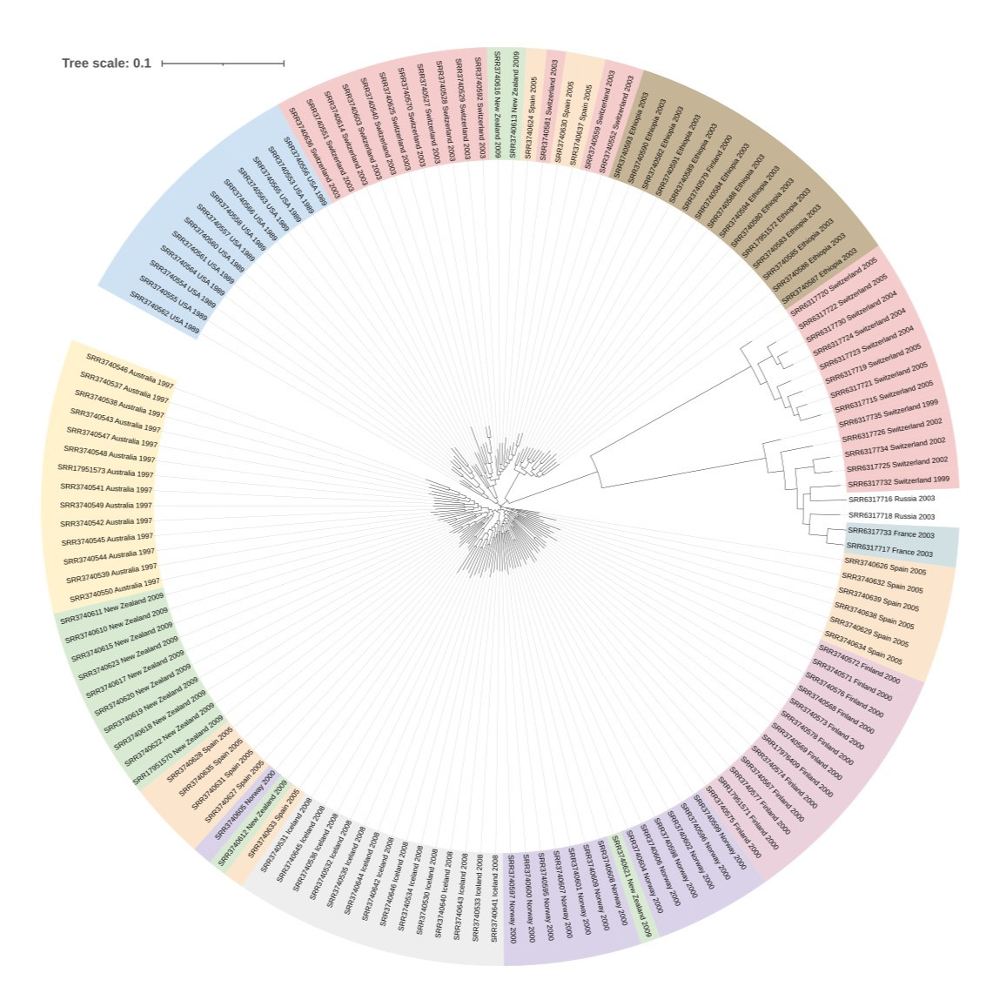
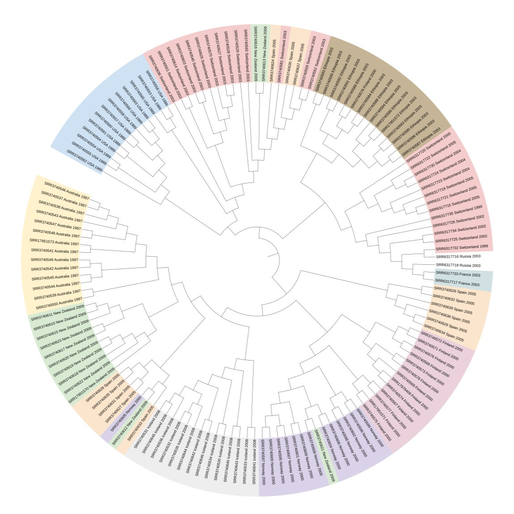

# *Rhynchosporium* Phylogeny
Phylogenetic tree reconstruction using available *Rhynchosporium commune* WGS data.

<br>

## Data Preparation

### Download WGS data and genome from NCBI
Search for *Rhynchosporium* DNA data on SRA and download metadata (SraRunTable.txt). Using ENA, generate a script to download all accessions from BioProjects PRJNA327656<sup>[1](#ref1)</sup> and PRJNA419548, and download to cluster: 
```bash
bash scripts/ena-file-download-selected-files-20240216-1125.sh
bash scripts/ena-file-download-selected-files-20240216-1138.sh
```

Download *R. commune* UK7 data and genome, and uncompress:
```bash
conda activate ncbi_datasets
datasets download genome accession GCA_900074885.1 --filename GCA_900074885.1.zip
```

### Quality Control
QC raw sequencing data:
```bash
for file in *gz; do 
    sbatch ../scripts/fastqc.sh $file
done

multiqc fastqc/
```

Trim adapters and low quality sequence, and QC trimmed reads:
```bash
mkdir trimmed && cd trimmed

# Trim
for file in ../reads/*_1.fastq.gz; do 
    file2=$(ls $file | sed s/"_1.fastq.gz"//g)
    sbatch ../scripts/trimmomatic_pe.sh $file "$file2"_2.fastq.gz
done

# QC trimmed reads
for file in *gz; do 
    sbatch ../scripts/fastqc.sh $file
done

multiqc fastqc/
```

Rename reads to "Run_geo_loc_name_country_Collection_Date_readDirection.fastq.gz":
```bash
python scripts/rename_reads.py SraRunTable.txt trimmed/ renamed_reads/
```

<br>

## Phylogenetic Tree

Assemble phylogenetic tree based on SNPs.

### Map reads to UK7 genome

Index UK7 genome:
```bash
bwa index R_commune_UK7.fasta
```

Map reads to genome:
```bash
mkdir alignment && cd alignment

for file in ../renamed_reads/*_F.fastq.gz; do 
    file2=$(ls $file | sed s/"_F.fastq.gz"//g)
    sbatch ../scripts/bwa-mem.sh ../UK7/R_commune_UK7.fasta $file "$file2"_R.fastq.gz
done
```

Sort and index alignments:
```bash
for file in *sam; do
    sbatch ../scripts/samtools_sort.sh $file
done
```

### Variant Calling
Index genome for variant calling:
```bash
samtools faidx R_commune_UK7.fasta
```

Generate pileup and call variants using bcftools 'c' model:
```bash
mkdir variant_calling && cd variant_calling

# Generate file containing full paths of BAM files
for file in ../alignment/*bam; do 
    realpath $file >> rhynchosporium.list
done

sbatch ../scripts/bcftools_call.sh ../UK7/R_commune_UK7.fasta rhynchosporium.list
```

### Variant Filtering
Check total number of variants:
```bash
bcftools view -H rhynchosporium.bcf | wc -l 
# 5911174
```

Remove sites with less than 10 supporting reads:
```bash
bcftools view rhynchosporium.bcf | vcfutils.pl varFilter -d10 - > rhynchosporium_filt.vcf

# Check number of remaining variants
bcftools view -H rhynchosporium_filt.vcf | wc -l 
# 4784455
```

Calculate average and maximum QUAL scores:
```bash
grep -v '^#' rhynchosporium_filt.vcf | awk 'BEGIN {max=0} {sum+=$6; if ($6>max) {max=$6}} END {print "Average qual: "sum/NR "\tMax qual: " max}'
# Average qual: 743.252   Max qual: 999
```

Check number of high quality (QUAL>800) SNPs and export to new file:
```bash
bcftools view rhynchosporium_filt.vcf -H -e 'QUAL<800' --types snps | wc -l 
# 3426167

bcftools view rhynchosporium_filt.vcf -e 'QUAL<800' --types snps > rhynchosporium_highqual.vcf
```

### Reconstruct Phylogenetic Tree
Convert vcf format to phylip file<sup>[2](#ref2)</sup>:
```bash
python ../scripts/vcf2phylip.py -i ./rhynchosporium_highqual.vcf
```

Remove invariant sites from the phylip file<sup>[2](#ref2)</sup>:
```bash
python ../scripts/ascbias.py -p ./rhynchosporium_highqual.min4.phy -o rhynchosporium_highqual.phy

# Check total samples and SNP sites
head -n1 rhynchosporium_highqual.phy
# 146 3417572
```

Run RAxML-ng:
```bash
sbatch ../scripts/raxml.sh rhynchosporium_highqual.phy
```

<br>

## Visualise Tree
Visualise tree using [iTOL](https://itol.embl.de/).

<center></center>
<center></center>

<br>

## References
<a id="ref1">1.</a> Mohd-Assaad N, McDonald BA, Croll D. Genome-Wide Detection of Genes Under Positive Selection in Worldwide Populations of the Barley Scald Pathogen. Genome Biol Evol. 2018 Apr 1;10(5):1315-1332. doi: 10.1093/gbe/evy087. PMID: 29722810; PMCID: [PMC5972619](https://www.ncbi.nlm.nih.gov/pmc/articles/PMC5972619)

<a id="ref2">2.</a> https://rdtarvin.github.io/IBS2019_Genomics-of-Biodiversity/main/2019/08/05/09-raxml-epi.html